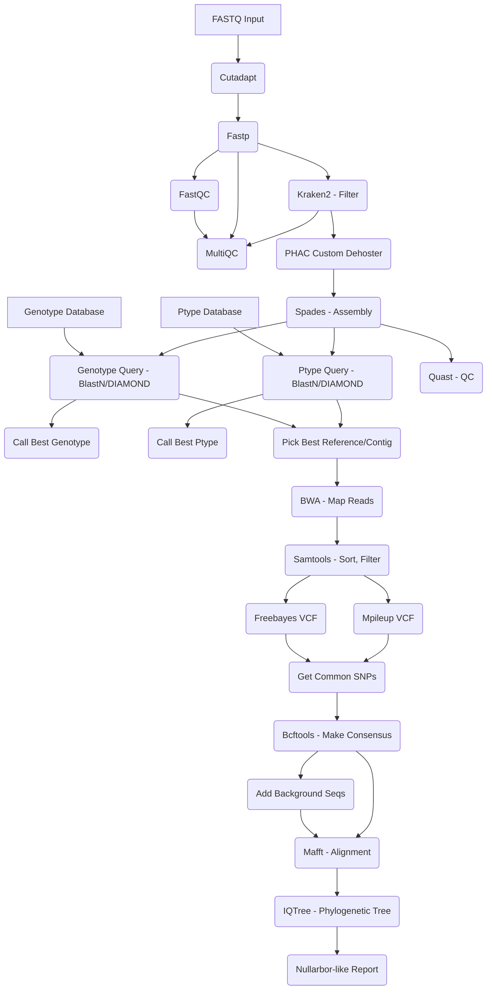

# Norovirus Nextflow pipeline

```mermaid
graph TD
A[FASTQ Input]  --> AA(Cutadapt)
AA --> D(Fastp)
D--> B(FastQC)
B --> C(MultiQC) 
D --> C
D --> G(Kraken2 - Filter)
G --> C
G --> I(PHAC Custom Dehoster)
I --> J(Spades - Assembly)
X[Genotype Database] --> K(Genotype Query - BlastN/DIAMOND)
Y[Ptype Database] --> KA(Ptype Query - BlastN/DIAMOND)
K --> KC(Call Best Genotype)
KA --> KD(Call Best Ptype)
K --> KE(Pick Best Reference/Contig)
KA --> KE
J --> K
J --> KA
J --> KB(Quast - QC)
KE --> M(BWA - Map Reads)
M --> N(Samtools - Sort, Filter)
N --> OA(Freebayes VCF)
N --> OB(Mpileup VCF)
OA --> P(Get Common SNPs)
OB --> P
P --> Q(Bcftools - Make Consensus)
Q --> QA(Add Background Seqs)
QA --> R(Mafft - Alignment)
Q --> R
R --> T(IQTree - Phylogenetic Tree)
T --> U(Nullarbor-like Report)


```
