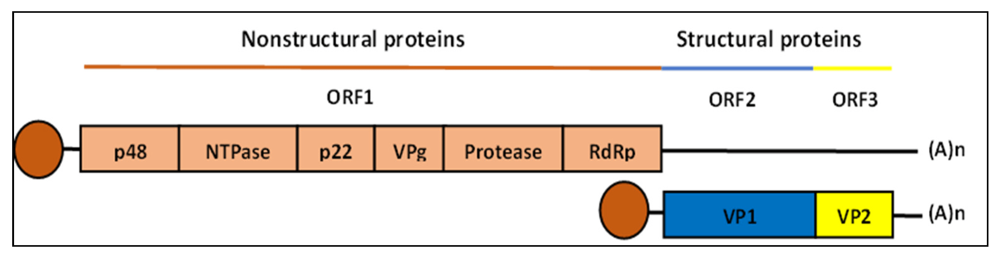
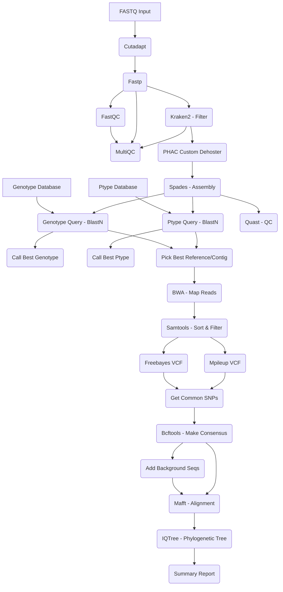

# Norovirus Nextflow Pipeline

## Overview 

Norovirus is a highly contagious virus responsible for causing gastroenteritis, an infection of the stomach and intestine. 
British Columbia sees outbreaks of Norovirus every year, particularly associated with consumption of contaminated batches of shellfish. 
This Nextflow pipeline aims to generate detailed typing, variant calling, and phylogenetic information for clinical Norovirus isolates sequenced using amplicon-based methods. 

## Norovirus Typing

Norovirus has a linear, positive-sense RNA genome approximately 7.5 kb in length with three open reading frames. 
Two genes of particular interest are the polymerase (RDRP) and capsid (VP1) genes located in ORF1 and ORF2, respectively. 
As Norovirus displays a strong propensity to recombine around the ORF1/2 boundary, researchers have adopted a dual typing scheme that combines both the capsid type (genotype) and polymerase type (p-type) in a single notation (genotype[p-type]) . 
To adhere to this dual typing scheme, this Norovirus pipeline branches at appropriate points in the workflow to type the capsid and polymerase genes independently. 
Typing these two genes independently ensures that previously unseen Norovirus combinations can be detected effectively.  

## Pipeline Diagram

